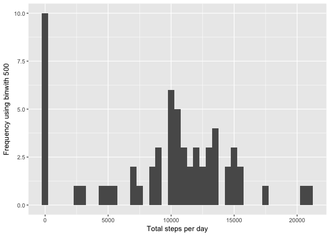
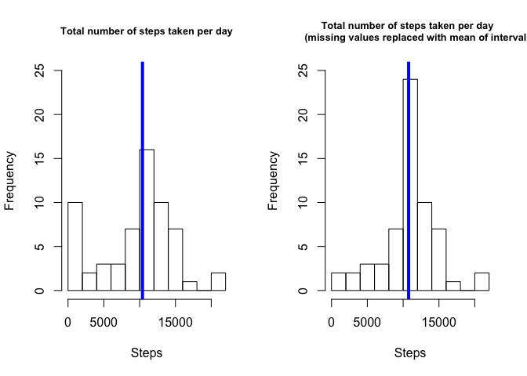
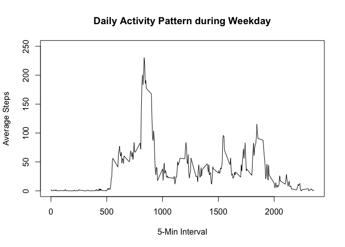
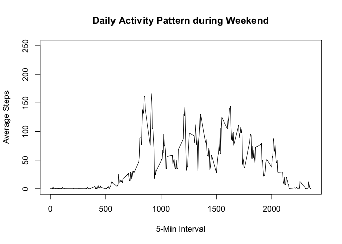

# Reproducible Research: Peer Assessment 1

```r
library(ggplot2)
```

```
## Warning: package 'ggplot2' was built under R version 3.3.2
```

```r
library(scales)
```

```
## Warning: package 'scales' was built under R version 3.3.2
```

```r
library(Hmisc)
```

```
## Warning: package 'Hmisc' was built under R version 3.3.2
```

```
## Loading required package: lattice
```

```
## Loading required package: survival
```

```
## Loading required package: Formula
```

```
## 
## Attaching package: 'Hmisc'
```

```
## The following objects are masked from 'package:base':
## 
##     format.pval, round.POSIXt, trunc.POSIXt, units
```
## Loading and preprocessing the data

```r
if(!file.exists('activity.csv')){
        unzip('activity.zip')
}
activityData <- read.csv('activity.csv')
```
## What is mean total number of steps taken per day?
- Code for reading in the dataset and/or processing the data

```r
stepsPerDay <- tapply(activityData$steps,activityData$date,sum, na.rm = TRUE)
```

- Histogram of the total number of steps taken each day

```r
library(ggplot2)
qplot(stepsPerDay,xlab='Total steps per day', ylab='Frequency using binwith 500', binwidth=500)
```

<!-- -->

- Mean and median number of steps taken each day

```r
stepsPerDayMean <- mean(stepsPerDay)
stepsPerDayMedian <- median(stepsPerDay)
```

## What is the average daily activity pattern?

```r
averageStepsPerInterval <- aggregate(x=list(meanSteps=activityData$steps),by=list(interval=activityData$interval),FUN = mean, na.rm = TRUE)
```

- Time series plot of the average number of steps taken

```r
ggplot(data=averageStepsPerInterval, aes(x=interval, y=meanSteps)) +
    geom_line() +
    xlab("5-minute interval") +
    ylab("average number of steps taken") 
```

<!-- -->

- The 5-minute interval that, on average, contains the maximum number of steps

```r
mostSteps <- which.max(averageStepsPerInterval$meanSteps)
timeMostSteps <- gsub("([0-9]{1,2})([0-9]{2})", "\\1:\\2", averageStepsPerInterval[mostSteps,'interval'])
```
## Imputing missing values
- Code to describe and show a strategy for imputing missing data

```r
numMissingValues <- length(which(is.na(activityData$steps)))
```


```r
activity_new <- activityData
activity_new[is.na(activity_new$steps),]$steps <- averageStepsPerInterval[match(activity_new[is.na(activity_new$steps),]$interval,averageStepsPerInterval$interval),2]
```

- Histogram of the total number of steps taken each day after missing values are imputed

```r
stepsPerDay_new <- tapply(activity_new$steps,activity_new$date,sum)

par(mfrow=c(1,2))
hist(stepsPerDay,10, main = "Total number of steps taken per day", xlab = "Steps"
     , ylim =c(0, 25),cex.main=0.8)
abline(v = median(stepsPerDay), col = 4, lwd = 4)
hist(stepsPerDay_new,10, main = "Total number of steps taken per day  
     (missing values replaced with mean of interval)", xlab = "Steps",
     ylim =c(0, 25),cex.main=0.8)
abline(v = median(stepsPerDay_new), col = 4, lwd = 4)
```

<!-- -->


## Are there differences in activity patterns between weekdays and weekends?
- Panel plot comparing the average number of steps taken per 5-minute interval across weekdays and weekends

```r
activity_new$date <- as.Date(activity_new$date)
activity_new$wd <- weekdays(activity_new$date)
activity_new$wd2 <- as.factor(c("weekend", "weekday"))
activity_new[activity_new$wd == "Sunday" | activity_new$wd == "Saturday" ,5]<- factor("weekend")
activity_new[!(activity_new$wd == "Sunday" | activity_new$wd == "Saturday"),5]<- factor("weekday")
activity_new_weekday <- subset(activity_new,wd2 == "weekday")
activity_new_weekend <- subset(activity_new,wd2 == "weekend")
daily_weekday <- tapply(activity_new_weekday$steps,activity_new_weekday$interval,mean)
daily_weekend <- tapply(activity_new_weekend$steps,activity_new_weekend$interval,mean)
```

- Plot 2 charts

```r
plot(y=daily_weekday,x=names(daily_weekday),type = "l",xlab="5-Min Interval",main = "Daily Activity Pattern during Weekday", ylab = "Average Steps", ylim = c(0,250))
```

<!-- -->

```r
plot(y=daily_weekend,x=names(daily_weekend),type = "l", xlab = "5-Min Interval", main = "Daily Activity Pattern during Weekend", ylab = "Average Steps", ylim = c(0,250))
```

<!-- -->
- All of the R code needed to reproduce the results (numbers, plots, etc.) in the report
